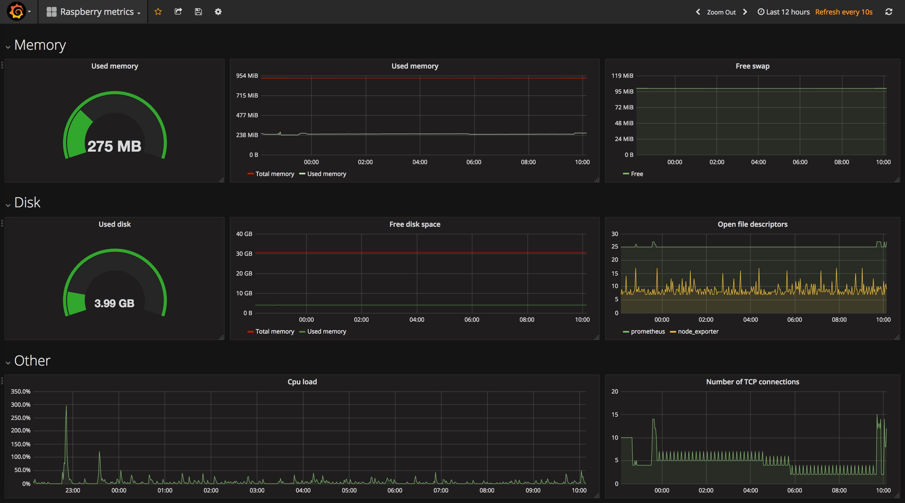
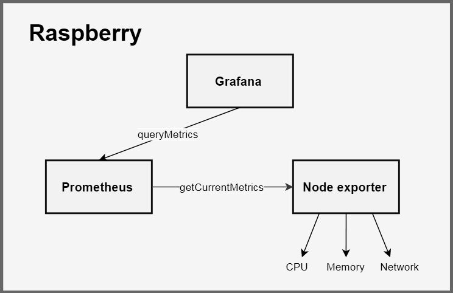
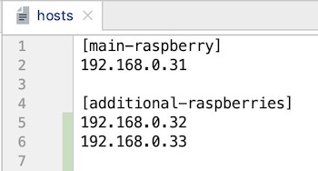
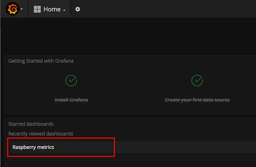
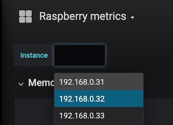

Raspberry metrics
=================

Expose raspberry PI metrics using [Grafana](https://grafana.com/) and [Prometheus](https://prometheus.io/):



## About ##

Visualise your Raspberry PI metrics. Very easy installation - requires single command. Supports multiple Raspberries.

This project contains [Ansible](https://www.ansible.com/) playbook which installs four services on Raspberry:

* [Node exporter](https://github.com/prometheus/node_exporter) - exposes Raspberry metrics
* [rpi_exporter](https://github.com/lukasmalkmus/rpi_exporter) - exposes CPU temperature as Prometheus metric 
* [Prometheus](https://prometheus.io/) - collects and stores metrics 
* [Grafana](https://grafana.com/) - metrics visualization 



### Prerequisites ###

* Raspberry PI with ARMv7 processor (Tested on [Raspberry PI 2 Model B](https://www.raspberrypi.org/products/raspberry-pi-2-model-b/))
* Debian installed on Raspberry (like [Raspbian Buster](https://www.raspberrypi.org/downloads/raspbian/))
* open port 22 on raspberry (SSH)
* open port 3000 on raspberry (Grafana)

## How to install ##

[Ansible](https://www.ansible.com/) is required for installation.

If you don't have Ansible installed, see [Ansible installation](http://docs.ansible.com/ansible/intro_installation.html).

### 1. Configure Raspberry IP address ###

Checkout project.

Edit file **ansible/hosts** and set Raspberry IP address in **main-raspberry** group. 

If you have more than one Raspberry PI, configure additional Raspberry PI addresses in **additional-raspberries** group.

Here is the example:



The "main" Raspberry will have all 4 services installed (Prometheus, Node exporter, rpi_exporter and Grafana), 
and the "additional Raspberries" will have Node exporter and rpi_exporter service installed. 

The main Raspberry will collect metrics from all additional Raspberries (if configured), so they must be accessible from the main Raspberry.

### 2. Run ansible playbook ###

Run Ansible playbook with password authentication:
```
    cd ansible/
    ansible-playbook raspberry.yml -i hosts -u pi -D -k -K
```

Or run Ansible playbook with SSH keys authentication:

```
    cd ansible/
    ansible-playbook raspberry.yml -i hosts -u pi -D
```

### 3. Check metrics ###

* Go to Grafana URL http://raspberry:3000/
* login with admin/admin
* Click on "Raspberry metrics" dashboard:



* If you have more than one Raspberry configured, you can select another Raspberry using **instance** dropdown: 


